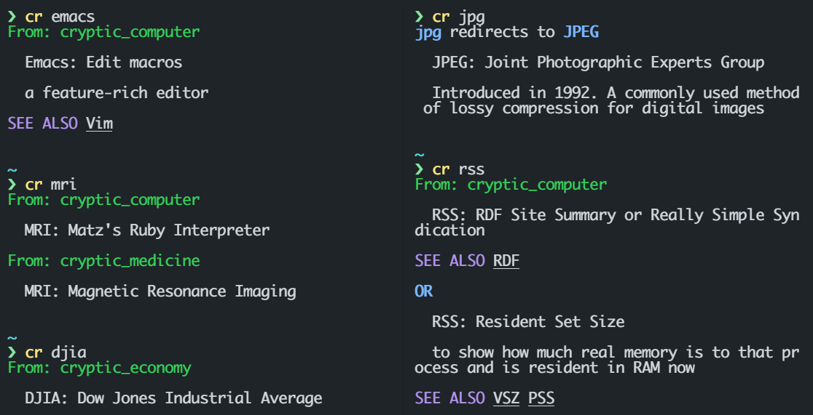

# Cryptic Resolver



<div align="center">

| **cr in Ruby** | **cr in D**  | **cr in Go** |
|:------------:|:---------:|:-----------:|
| [](https://rubygems.org/gems/cryptic-resolver)  | [][cr_D] |Not maintain anymore|

</div>


<br>

## Install

Ruby versiond `cr` is the reference implementation, always up-to-date.
```bash
gem install cryptic-resolver
```

<br>

Pre-built binaries for `cr` via [cr_D]

**For Windows user**
```powershell
# D version (smaller size than go version) 
scoop install "https://raw.githubusercontent.com/cryptic-resolver/cr_D/main/install/cryptic-resolver.json"
```


**For Linux user**
```bash
# D version (bigger size than go version)
bash -c "$(curl -fsSL https://raw.githubusercontent.com/cryptic-resolver/cr_D/main/install/i.sh)"
```


**For macOS user**
```bash
# Not prebuilt. Build it for yourself please
```

[cr_Go]: https://github.com/cryptic-resolver/cr_Go
[cr_D]: https://github.com/cryptic-resolver/cr_D
